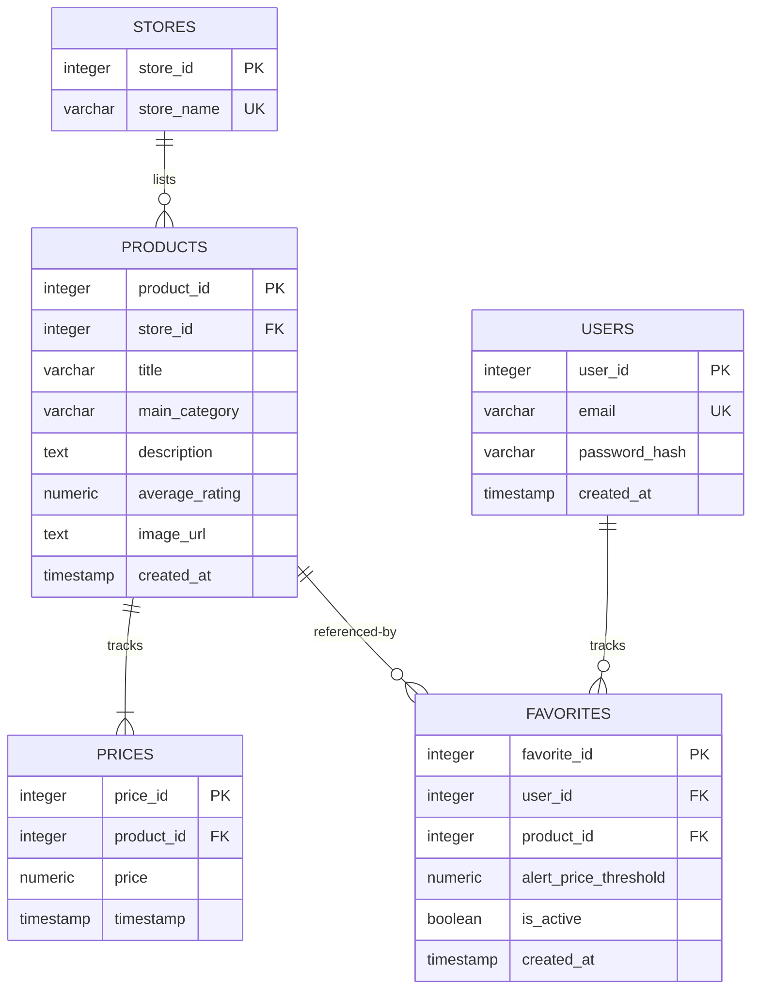

# Cheemo — Smart Local Price Checker Requirements Specification

This document details the functional and non-functional requirements, data mapping schemas, API endpoint specifications, and system guarantees for **Cheemo**, a web-based local price tracking and analysis application.

---

## Table of Contents
1. [Introduction & Scope](#1-introduction--scope)
2. [User Personas & Roles](#2-user-personas--roles)
3. [Functional Requirements (FR)](#3-functional-requirements-fr)
4. [Non-Functional Requirements (NFR)](#4-non-functional-requirements-nfr)
5. [Database Schema Design](#5-database-schema-design)
6. [API Endpoint Specifications](#6-api-endpoint-specifications)
7. [Frontend-Backend Model Alignment](#7-frontend-backend-model-alignment)

---

## 1. Introduction & Scope

Cheemo aggregates product price details from multiple local online storefronts, compiles historic records, detects significant price drops, and allows users to track their preferred items. 

The scope of this project includes:
- **Scheduled and Manual ETL pipelines** to ingest, sanitize, and load raw product feeds.
- A **relational database schema** tracking store details, product listings, and historical pricing points.
- A **FastAPI REST backend** implementing routing skeletons for authentication, search, watchlist favorites, and health status checks.
- A **Vite + React single-page application** showcasing trending discounts, searchable product listings, historical price charts, and a user dashboard.

---

## 2. User Personas & Roles

### 2.1 Guest (Unauthenticated User)
- **Use Case**: Browses trending drops and price comparisons.
- **Access**: Can search catalog, view product details, check historical charts, but cannot create favorites or watchlists.

### 2.2 Customer (Authenticated User)
- **Use Case**: Monitors specific products and configures alerts.
- **Access**: Inherits all Guest permissions. Can manage a watchlist, configure custom alert thresholds, and choose notification channels.

### 2.3 Administrator (Service Monitor/Operator)
- **Use Case**: Oversees backend operations, runs manual ingestion tasks, and monitors system performance.
- **Access**: Inherits all Customer permissions. Has access to the Admin Dashboard routes to view system and database metrics, and manually trigger ETL jobs.

---

## 3. Functional Requirements (FR)

### 3.1 Data Ingestion & ETL Ingestion Pipeline (FR-1)
- **FR-1.1**: The ingestion script must read lines from JSON Lines (`.jsonl`) files containing product listings.
- **FR-1.2**: Prices must be sanitized and converted into a SQL numeric/decimal type (e.g., stripping currency symbols like `$` and commas).
- **FR-1.3**: Image URLs must be extracted from lists of image objects by retrieving high-resolution (`hi_res`), large (`large`), or thumbnail (`thumb`) links in descending priority.
- **FR-1.4**: If a store name does not exist in the `stores` table, the pipeline must dynamically create it and link it using a unique identifier.
- **FR-1.5**: All database operations per batch (default size: 500) must execute within a transactional block. In case of failure, the batch transaction must roll back.

### 3.2 Product Catalog, Search & Filtering (FR-2)
- **FR-2.1**: The system must expose endpoints to query and paginate products.
- **FR-2.2**: Fuzzy product search must be implemented on the backend using PostgreSQL text search or the `pg_trgm` extension to allow minor spelling variations.
- **FR-2.3**: Search results must be filterable by category and store.
- **FR-2.4**: The frontend must display a search bar that updates catalog results, with a debounce timer of at least 300ms to throttle API queries.

### 3.3 Historical Price Tracking & Charts (FR-3)
- **FR-3.1**: Each product record must link to multiple pricing entries in a time-series schema.
- **FR-3.2**: The backend must return chronological price histories for any given product ID.
- **FR-3.3**: The frontend must display price histories using interactive charts (e.g., Chart.js) with clear markers indicating date and pricing fluctuations.

### 3.4 Deal Discovery & Discount Detection (FR-4)
- **FR-4.1**: The system must compute the baseline price (e.g., maximum historical price or original price) and compare it against the current (most recent) price to determine the discount percentage.
- **FR-4.2**: The backend must provide a query parameter or path to retrieve "Trending Drops" ordered by discount percentage in descending order.
- **FR-4.3**: Products without a recorded price reduction must not appear in the discount feed.

### 3.5 User Authentication & Account Management (FR-5)
- **FR-5.1**: Users must be able to register with a unique email and password.
- **FR-5.2**: Passwords must be securely hashed on the backend using strong hashing utilities (e.g., Argon2 or bcrypt) before storage.
- **FR-5.3**: Authentication sessions must use JWT (JSON Web Tokens) or secure session cookies transmitted with HTTPOnly flags.
- **FR-5.4**: Protected routes must validate authorization header tokens.

### 3.6 Watchlists & Alert Thresholds (FR-6)
- **FR-6.1**: Authenticated users must be able to add/remove products to/from a personal watchlist.
- **FR-6.2**: Users must be able to specify a custom target threshold (alert price).
- **FR-6.3**: Users must be able to toggle alerts on or off for individual items in their watchlist.

### 3.7 Notification Engine (FR-7)
- **FR-7.1**: A periodic job must evaluate prices newly written to the database against user-defined thresholds.
- **FR-7.2**: The engine must support dispatching email alerts when a product price drops below a user's target threshold.
- **FR-7.3**: The system must support developer integration webhooks (e.g., Slack or Discord payloads) to report daily trending price drops.

---

## 4. Non-Functional Requirements (NFR)

### 4.1 Performance & Latency (NFR-1)
- **NFR-1.1**: The product search backend endpoint must return results within 200ms for database sizes up to 100,000 items.
- **NFR-1.2**: Ingestion throughput of the ETL pipeline must exceed 200 product records per second on baseline hardware.

### 4.2 Scalability & Database Growth (NFR-2)
- **NFR-2.1**: Database indexes must be placed on frequently queried fields:
  - B-Tree index on `prices.product_id` and `prices.timestamp`.
  - Trigram/GIN index on `products.title` for search performance.
  - Unique constraint indexes on `stores.store_name` and `users.email`.
- **NFR-2.2**: The system must support scheduled database table vacuuming and log rotations to manage disk usage.

### 4.3 Reliability & Ingestion Fault Tolerance (NFR-3)
- **NFR-3.1**: The ETL process must log ingestion statistics (records processed, errors encountered, skip reasons).
- **NFR-3.2**: Missing description, image, or category fields must not crash the ETL process; default fallbacks must be populated.
- **NFR-3.3**: Invalid price strings must result in skipping the specific record and logging a warning, without aborting the script.

### 4.4 Security & Compliance (NFR-4)
- **NFR-4.1**: API routers must enable CORS (Cross-Origin Resource Sharing) policies restricted to defined frontend origins.
- **NFR-4.2**: API payloads must be validated using schema parsing tools (e.g., FastAPI's Pydantic validation).
- **NFR-4.3**: Database configurations and API keys must be loaded via environmental variables (`.env`) rather than hardcoded.

### 4.5 Usability & Interface Design (NFR-5)
- **NFR-5.1**: The frontend layout must be fully responsive, scaling cleanly from mobile screens (320px width) to desktop layouts (1440px+).
- **NFR-5.2**: Interactive elements must provide visual feedback (e.g., scale transitions, hover micro-animations).
- **NFR-5.3**: Accessibility standards must match WCAG 2.1 AA requirements (proper contrast ratios, semantic tag structures).

---

## 5. Database Schema Design

The following tables define the relational database structure in PostgreSQL 16:

---

## 6. API Endpoint Specifications

All endpoint URLs are prefixed with `/api` (or custom gateway path).

### 6.1 Authentication Routes (`auth.py`)
- **POST `/auth/register`**
  - **Payload**: `{ email, password }`
  - **Response**: `{ message, user_id }`
- **POST `/auth/login`**
  - **Payload**: `{ email, password }`
  - **Response**: `{ token_type: "bearer", access_token }`

### 6.2 Product Discovery Routes (`products.py`)
- **GET `/products`**
  - **Query Parameters**: `page`, `limit`, `category`, `store_id`
  - **Response**: Paginated array of products.
- **GET `/products/{product_id}`**
  - **Response**: Detailed product metadata including chronological price histories.
- **GET `/products/search`**
  - **Query Parameters**: `query`, `page`
  - **Response**: Search result matches.
- **GET `/products/trending`**
  - **Query Parameters**: `limit`
  - **Response**: Listings showing largest percentage drops.

### 6.3 Watchlist Favorites Routes (`favorites.py`)
- **GET `/favorites`** (Auth Required)
  - **Response**: User watchlist items.
- **POST `/favorites`** (Auth Required)
  - **Payload**: `{ product_id, alert_price_threshold }`
  - **Response**: `{ favorite_id, status: "created" }`
- **DELETE `/favorites/{favorite_id}`** (Auth Required)
  - **Response**: `{ status: "removed" }`

### 6.4 Admin Operations (`admin.py`)
- **GET `/admin/stats`** (Auth Required, Admin only)
  - **Response**: System usage metrics (e.g., user count, product count, price count, database size).
- **POST `/admin/etl/trigger`** (Auth Required, Admin only)
  - **Payload**: `{ file_path }`
  - **Response**: Ingestion status report.

### 6.5 System Health Checks (`health.py`)
- **GET `/health`**
  - **Response**: `{ status: "ok", database_connected: true }`

---

## 7. Frontend-Backend Model Alignment

To ensure type-safety across TypeScript and Python, the following field mapping conventions must be observed:

| Frontend Property (TS Interface) | Backend Database / Pydantic Field | Data Type | Notes |
|---|---|---|---|
| `id` | `product_id` | Integer / String | Cast to string on frontend. |
| `name` | `title` | String | Map backend title to frontend name representation. |
| `description` | `description` | Text | Long description fallback is empty string. |
| `category` | `main_category` | String | Maps product department. |
| `currentPrice` | `price` (most recent) | Decimal / Float | Obtained via sub-query on latest prices record. |
| `originalPrice` | max(`price`) / baseline | Decimal / Float | Derived from price history. |
| `discountPercentage` | Calculated | Float | Derived: `((original - current) / original) * 100`. |
| `imageUrl` | `image_url` | Text | Fully qualified HTTP/S URL. |
| `priceHistory` | array of prices | Array | Converted from `timestamp` + `price` rows. |
