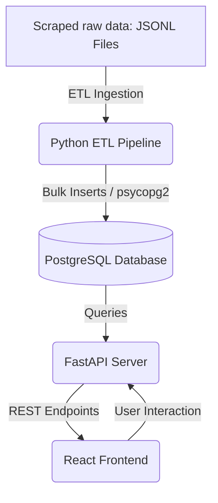

# Cheemo — Smart Local Price Checker
## Vision, System Architecture, & Technical Roadmap

Cheemo is a web-based data analytics platform designed to solve a common consumer problem: price volatility and lack of visibility across local online retail markets. By aggregating pricing data from multiple online storefronts, Cheemo empowers users to track price trends, identify significant discounts, and receive timely alerts on price drops.

---

## 1. Core Value Propositions

- **Multi-Store Price Aggregation**: Eliminate the need to manually browse multiple retail sites. Cheemo consolidates product and pricing data into a unified experience.
- **Historical Price Analytics**: Users can view the trajectory of a product's price over time to verify if a "sale" price is genuinely a good deal or simply a minor fluctuation.
- **Smart Price Drops (Deals Discovery)**: Proactively highlight products with the largest discount percentages relative to their historic pricing baseline.
- **User-Centric Monitoring**: Allow users to maintain personal watchlists and configure notification thresholds (e.g., alert when a product drops below $100).

---

## 2. Tech Stack & Environment

Cheemo is built using modern, light-weight, and highly-performant open-source software:

- **Frontend Application**:
  - **Framework**: React 18, Vite, TypeScript
  - **Styling**: Tailwind CSS (v4), Custom Vanilla CSS
  - **Animations**: Framer Motion
  - **Icons**: Lucide React
- **Backend API**:
  - **Framework**: FastAPI (Python)
  - **Database Interface**: psycopg2
  - **Server**: Uvicorn
- **Database**:
  - **Engine**: PostgreSQL 16
- **DevOps & Ingestion**:
  - **Orchestration**: Docker Compose
  - **Task Scheduler**: Cron
  - **Automation Scripts**: Python & Bash

---

## 3. Current System Architecture

The project is structured as a containerized multi-service application with the following key components:

### A. Data Ingestion & ETL Pipeline
The ingestion pipeline is implemented in Python under the [backend/ETL](file:///C:/Cheemo---Smart-Local-Price-Checker/backend/ETL) directory. It operates in three stages:

1. **Extract** ([extract.py](file:///C:/Cheemo---Smart-Local-Price-Checker/backend/ETL/extract.py)): Reads lines from raw JSON Lines (`.jsonl`) files containing raw store product details.
2. **Transform** ([transform.py](file:///C:/Cheemo---Smart-Local-Price-Checker/backend/ETL/transform.py)): Cleans the product attributes:
   - Sanitizes and parses pricing strings into `Decimal` representations.
   - Extracts high-resolution, large, or thumbnail image URLs.
   - Validates that the record contains at least a valid name and price before inserting.
3. **Load** ([load.py](file:///C:/Cheemo---Smart-Local-Price-Checker/backend/ETL/load.py)): Efficiently loads data into PostgreSQL in batches (default size: 500) using transaction safety:
   - Registers new stores dynamically to retrieve a `store_id`.
   - Inserts products into the `products` table.
   - Appends current prices into the `prices` table with reference to the `product_id`.

### B. Backend API Layer
The server entry point is [main.py](file:///C:/Cheemo---Smart-Local-Price-Checker/backend/main.py) which handles routing and database session management via [database.py](file:///C:/Cheemo---Smart-Local-Price-Checker/backend/database.py). 

The route skeletons defined in [backend/Routes](file:///C:/Cheemo---Smart-Local-Price-Checker/backend/Routes) cover:
- `products.py`: Querying and searching products.
- `favorites.py`: Managing user-tracked items.
- `auth.py`: Handling user registration and session tokens.
- `admin.py`: Privileged actions and ingestion statistics.
- `health.py`: Database connection and system health checks.

### C. Frontend Client
A fast, single-page application built on Vite and React (located in the [frontend](file:///C:/Cheemo---Smart-Local-Price-Checker/frontend) directory):
- **User Interface**: Designed with custom responsive grids and smooth motion transitions using Framer Motion (see [TrendingDrops.tsx](file:///C:/Cheemo---Smart-Local-Price-Checker/frontend/src/components/TrendingDrops.tsx)).
- **API Services**: Interacts with the backend routes via standard Fetch/Axios utilities defined in [api.ts](file:///C:/Cheemo---Smart-Local-Price-Checker/frontend/src/services/api.ts).

---

## 4. Architectural & Data Flow Diagrams
To review detailed specifications, check the visual diagrams in the documentation directory:
- [Architecture Diagram](file:///C:/Cheemo---Smart-Local-Price-Checker/Documentation/Cheemo%20-%20architecture%20diagram.drawio.png)
- [Data Flow Diagram](file:///C:/Cheemo---Smart-Local-Price-Checker/Documentation/Cheemo%20-%20Data%20Flow%20Diagram.drawio.png)

---

## 5. Technical Roadmap

Cheemo will evolve across four distinct phases:

### Phase 1: API Integration & Schema Finalization
*   Replace mock data in the frontend [api.ts](file:///C:/Cheemo---Smart-Local-Price-Checker/frontend/src/services/api.ts) with real HTTP requests targeting the FastAPI backend.
*   Finalize the database schema with indices on `products.title` (using `pg_trgm` for fuzzy search) and `prices.timestamp` to accelerate time-series charts.
*   Implement container orchestration healthchecks inside [docker-compose.yml](file:///C:/Cheemo---Smart-Local-Price-Checker/docker-compose.yml).

### Phase 2: Personalization & Authentication
*   Fully implement authentication routes ([auth.py](file:///C:/Cheemo---Smart-Local-Price-Checker/backend/Routes/auth.py)) using JWT (JSON Web Tokens) or session cookies.
*   Create user accounts and a backend table for `favorites` / `watchlists` to store custom price drop thresholds per product.
*   Extend the frontend with a "My Dashboard" view to display user watchlists.

### Phase 3: Active Scrapers & Notification Engine
*   Transition from static `.jsonl` files to live/periodic web scraper modules (e.g., using Playwright or BeautifulSoup).
*   Add a notification engine that queries price histories, identifies new price drops, and dispatches alerts via:
    - Email (SMTP)
    - Browser Web Push notifications
    - Webhooks (Discord/Slack integrations for developers)

### Phase 4: Data Analytics & Intelligence
*   Integrate Chart.js fully in the frontend to display rich price histories.
*   Introduce smart categorization algorithms to automatically map products across different stores (e.g., identifying that "Store A's Laptop 14" is the exact same product as "Store B's UltraSlim 14-inch Laptop").
*   Explore lightweight regression models to predict future price drops based on seasonal shopping trends (e.g., Black Friday, Back-to-school sales).
